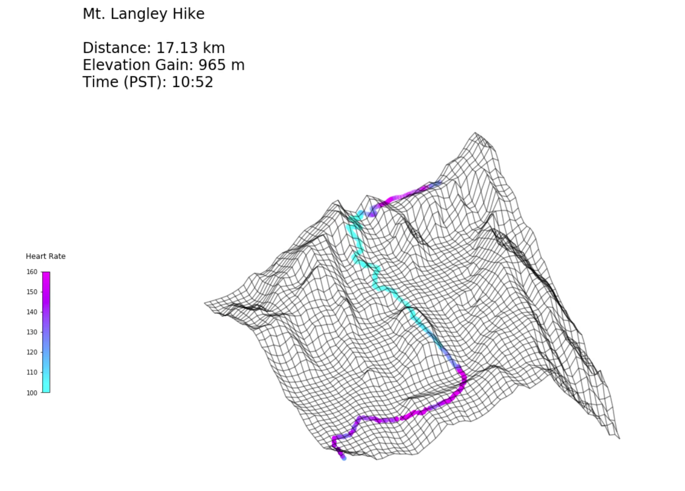

# Garmin + Google Maps Visualization

> This jupyter notebook plots heart rate and GPS position, as recorded by a Garmin smartwatch, on top of a wireframe plot of Google Maps Elevation data. Perfect for visualizing your most recent hike!
>
> In the event that your Garmin GPS wasn't properly calibrated while recording, you can override the coordinates of highest elevation point with known summit coordinates that you enter. All other coordinates will be adjusted accordingly.
>
> Running the code does require a key for the Google Maps Elevation API. You can get started with a free trial [here](https://developers.google.com/maps/documentation/elevation/start)
>
> Further work needs to be done to export the visualization to a video file, instead of simply viewing it in the console.

